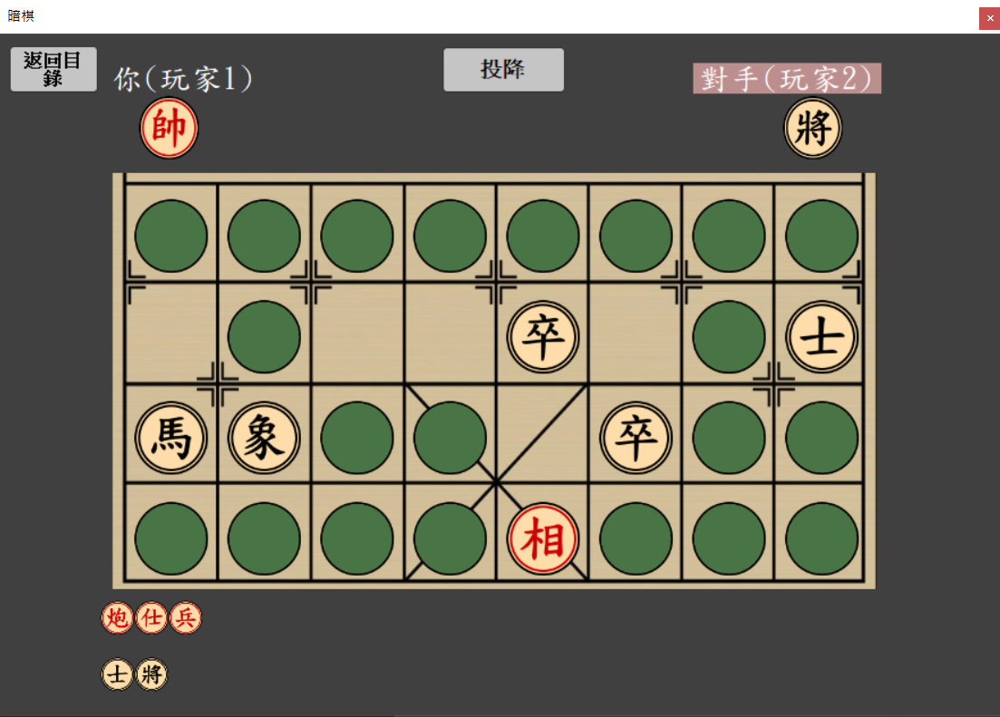

# ChineseDarkChess 暗棋
A really simple dark chess game develop with c#.

You can play in local mode, or multiplayer mode which needs a server to run to connect both players.

## Menu

## Local play

## Multiplayer

### Connect to a server

> Win a game either you take all enemy's pieces or your opponent surrenders.
### Game preview
